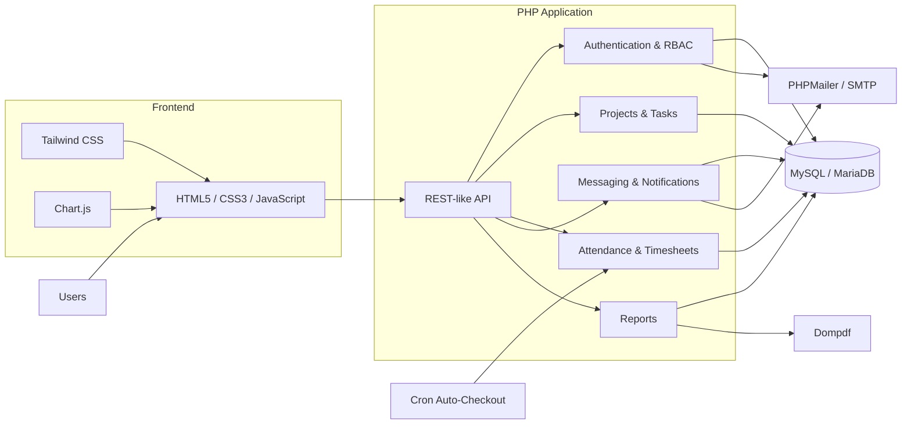

<p align="center">
  
</p>

<p align="center">
  <strong>A lightweight, self-hosted Remote Team Management System</strong>
  <br>
  Built with PHP, MySQL, HTML, CSS and JavaScript for small to medium teams.
</p>

<p align="center">
  <a href="https://github.com/Ryson-Theo/RemoteTeamPro">
    
  </a>
  <a href="https://www.php.net/">
    
  </a>
  <a href="https://www.mysql.com/">
    
  </a>
  <a href="https://opensource.org/licenses/MIT">
    
  </a>
</p>

<p align="center">
  Centralizes project coordination, task tracking, attendance & timesheets,
  internal messaging, notifications, client portals and reporting —
  without requiring a subscription or cloud dependency.
</p>

<p align="center">
  <a href="#key-features">Features</a>
  •
  <a href="#screenshots">Screenshots</a>
  •
  <a href="#architecture">Architecture</a>
  •
  <a href="#technology-stack">Stack</a>
  •
  <a href="#installation-and-configuration">Installation</a>
  •
  <a href="#api-documentation">API</a>
  •
  <a href="#troubleshooting">Troubleshooting</a>
  •
  <a href="#contributors">Contributors</a>
</p>

---

## Overview

**RemoteTeamPro** is a self-hosted remote team management system designed to bring common team operations into one application.

It provides role-based dashboards for:

* Administrators
* Managers
* Employees
* Clients

The system combines project and task management with attendance, timesheets, internal communication, notifications, client access and report generation.

It can be run locally using **XAMPP** or deployed to a compatible **LAMP/LEMP** environment.

---

## Screenshots

The interface is presented below as a gallery: each screenshot is paired with its corresponding functionality for easier visual scanning.

<table>
  <tr>
    <td width="56%" align="center" valign="middle">
      
    </td>
    <td width="44%" valign="middle">
      <h3>Home / Landing Page</h3>
      <p>
        Entry point for the application with authentication and registration
        options for users.
      </p>
      <sub>Authentication entry • Registration • Responsive landing interface</sub>
    </td>
  </tr>
</table>

<br>

<table>
  <tr>
    <td width="56%" align="center" valign="middle">
      
    </td>
    <td width="44%" valign="middle">
      <h3>Admin Dashboard</h3>
      <p>
        Central administration interface for analytics, user management,
        companies, projects, reports and system-level configuration.
      </p>
      <sub>Analytics • User management • Reports • Administration</sub>
    </td>
  </tr>
</table>

<br>

<table>
  <tr>
    <td width="56%" align="center" valign="middle">
      
    </td>
    <td width="44%" valign="middle">
      <h3>Manager Project Management</h3>
      <p>
        Managers can create projects, assign tasks, monitor progress,
        review team activity and coordinate work.
      </p>
      <sub>Projects • Tasks • Assignments • Progress tracking</sub>
    </td>
  </tr>
</table>

<br>

<table>
  <tr>
    <td width="56%" align="center" valign="middle">
      
    </td>
    <td width="44%" valign="middle">
      <h3>Employee Tasks & Timesheets</h3>
      <p>
        Employees can manage assigned work, update task status,
        record attendance and log task-related working hours.
      </p>
      <sub>Tasks • Attendance • Timesheets • Work hours</sub>
    </td>
  </tr>
</table>

<br>

<table>
  <tr>
    <td width="56%" align="center" valign="middle">
      
    </td>
    <td width="44%" valign="middle">
      <h3>Client Project Portal</h3>
      <p>
        Clients can follow project timelines and milestones,
        access reports and communicate directly with the assigned manager.
      </p>
      <sub>Project timelines • Milestones • Reports • Messaging</sub>
    </td>
  </tr>
</table>

---

## Key Features

### Role-Based Access Control

Four application roles with separate responsibilities and permissions:

* **Admin**
* **Manager**
* **Employee**
* **Client**

### User Management

* OTP email verification
* Registration and authentication
* Password reset
* Email change verification
* Profile picture upload
* Activity logging

### Project & Task Management

* Create and manage projects
* Create and assign tasks
* Task deadlines
* Status updates
* Progress tracking
* Manager-based team coordination

### Attendance & Timesheets

* Employee check-in / check-out
* Task-linked working hours
* Attendance history
* Manager review
* Automatic checkout for unfinished sessions
* Cron-based attendance processing

### Internal Messaging

* Role-aware conversations
* Send and fetch messages
* Conversation listing
* Read/unread status
* Automatically seeded conversations for new users

### Notifications

* In-app notifications
* Email notifications
* Task-related alerts
* Deadline notifications
* Messaging notifications
* PHPMailer-based email delivery

### Client Portal

* Project timelines
* Milestone tracking
* Project progress
* Report downloads
* Direct manager communication

### Reporting

* Generate project reports
* Generate timesheet reports
* PDF exports
* Email reports
* Performance analytics

### Authentication

OTP-based flows are supported for:

* Login
* Registration
* Password reset
* Email change verification

### Responsive Interface

The interface is designed to work across:

* Desktop
* Tablet
* Mobile

---

## Architecture



### Request Flow

```text
User
  │
  ▼
Frontend UI
  │
  ▼
PHP API
  │
  ├── Authentication / RBAC
  ├── Projects & Tasks
  ├── Attendance / Timesheets
  ├── Messaging
  └── Reports
        │
        ▼
   MySQL / MariaDB

Supporting services:
  ├── PHPMailer → SMTP / Email
  ├── Dompdf    → PDF Reports
  └── Cron      → Attendance Auto-Checkout
```

---

## Project Structure

```text
RemoteTeamPro/
│
├── backend/
│   ├── api/
│   │   ├── auth/
│   │   ├── attendance/
│   │   ├── messages/
│   │   ├── reports/
│   │   ├── dashboard/
│   │   ├── profile/
│   │   ├── users.php
│   │   └── projects.php
│   │
│   ├── config/
│   └── logs/
│
├── database/
│   └── schema.sql
│
├── frontend/
│
├── screenshots/
│   ├── home-landing-page.png
│   ├── admin-dashboard.png
│   ├── manager-projects.png
│   ├── employee-tasks-timesheet.png
│   └── client-timeline.png
│
├── templates/
│   └── email/
│
├── assets/
│   └── remoteteampro-header.svg
│
├── composer.json
├── composer.lock
├── .gitignore
└── README.md
```

---

## Technology Stack

| Layer                 | Technology              |
| --------------------- | ----------------------- |
| Backend               | PHP 7.4+                |
| Database              | MySQL / MariaDB         |
| Frontend              | HTML5, CSS3, JavaScript |
| Styling               | Tailwind CSS            |
| Charts                | Chart.js                |
| Email                 | PHPMailer               |
| PDF Generation        | Dompdf                  |
| Dependency Management | Composer                |
| Local Development     | XAMPP                   |
| Web Server            | Apache                  |
| Compatible Hosting    | LAMP / LEMP             |

---

## User Roles & Functionalities

### Admin

* Full control over users, companies, projects and settings
* View activity logs
* Handle contact requests
* Generate reports
* Configure SMTP and notification settings

### Manager

* Create and assign projects
* Create and assign tasks
* Monitor team progress
* Review attendance and timesheets
* Review client requests
* Communicate with employees and clients

### Employee

* View assigned projects and tasks
* Update task status
* Log daily attendance
* Record task hours
* Send and receive messages
* Manage personal profile

### Client

* View assigned project timelines
* Track project progress
* View milestones
* Download reports and PDFs
* Communicate with assigned manager
* Receive automated notifications

---

## Installation and Configuration

### Prerequisites

Install the following before running the project:

* XAMPP — Apache + MySQL + PHP ≥ 7.4
* Composer
* Git
* VS Code or another code editor

### 1. Clone the Repository

Place the project inside your XAMPP web root.

```bash
cd C:\xampp\htdocs

git clone https://github.com/Ryson-Theo/RemoteTeamPro.git

cd RemoteTeamPro
```

Alternatively, download and extract the repository directly into:

```text
C:\xampp\htdocs\RemoteTeamPro
```

### 2. Install PHP Dependencies

```bash
composer install
```

### 3. Start XAMPP

Start:

```text
Apache
MySQL
```

### 4. Create the Database

Open:

```text
http://localhost/phpmyadmin
```

Create a database:

```text
remoteteampro
```

Then import:

```text
database/schema.sql
```

### 5. Configure Database Connection

Edit:

```text
backend/config/database.php
```

Configure:

```text
Database host
Database username
Database password
Database name
```

### 6. Configure SMTP

Edit:

```text
backend/config/smtp.php
```

Configure the required SMTP credentials.

For Gmail, an **App Password** is recommended where applicable.

### 7. Configure Upload Permissions

Make sure the profile picture upload directory is writable:

```text
uploads/profile_pictures/
```

Typical permissions:

```text
755
```

or

```text
775
```

### 8. Launch

Open:

```text
http://localhost/RemoteTeamPro
```

Complete the initial setup through the application UI.

For production deployments:

* Secure configuration files
* Enable HTTPS
* Harden filesystem permissions
* Protect SMTP credentials
* Add rate limiting
* Review authentication and API security

---

## Usage

### Start the Application

Start Apache and MySQL through XAMPP.

Then open:

```text
http://localhost/RemoteTeamPro
```

### Authentication

Register a new account or log in with an existing account.

OTP verification is required for supported authentication flows.

### Create a Company

After authentication:

```text
Create Company
      ↓
Invite / Manage Users
      ↓
Create Projects
      ↓
Create & Assign Tasks
      ↓
Track Progress
      ↓
Attendance / Timesheets
      ↓
Reports & Communication
```

---

## Cron Job

RemoteTeamPro includes an automatic checkout endpoint for unfinished attendance sessions.

Recommended scheduling:

```bash
# Run every day at midnight
0 0 * * * /usr/bin/php /path/to/RemoteTeamPro/backend/api/attendance/auto-checkout-cron.php
```

This can be configured through the operating system's cron scheduler.

---

# API Documentation

The backend exposes REST-like endpoints through:

```text
backend/api/
```

Base URL for local development:

```text
/RemoteTeamPro/backend/api/
```

Requests and responses use JSON where applicable.

Authentication is handled through the application's session/authentication flow.

Always include CSRF protection where applicable.

---

## Authentication Endpoints

| Endpoint                   | Method | Description            | Parameters                  |
| -------------------------- | ------ | ---------------------- | --------------------------- |
| `auth/login.php`           | POST   | User login             | `email`, `password`         |
| `auth/register.php`        | POST   | Register user          | `email`, `password`, `role` |
| `auth/verify-otp.php`      | POST   | Verify OTP             | `otp`, `email`              |
| `auth/forgot-password.php` | POST   | Request password reset | `email`                     |
| `auth/reset-password.php`  | POST   | Reset password         | `otp`, `new_password`       |
| `auth/logout.php`          | POST   | Logout user            | None                        |
| `auth/change-email.php`    | POST   | Change email           | `new_email`                 |

Example successful login response:

```json
{
  "success": true,
  "user": {}
}
```

---

## Attendance Endpoints

| Endpoint                             | Method | Description                 | Parameters          |
| ------------------------------------ | ------ | --------------------------- | ------------------- |
| `attendance/attendance-employee.php` | POST   | Employee check-in/out       | `action`, `task_id` |
| `attendance/attendance-manager.php`  | GET    | Manager timesheet view      | `employee_id`       |
| `attendance/auto-checkout-cron.php`  | GET    | Auto-checkout open sessions | None                |

Example:

```text
action = checkin
```

or:

```text
action = checkout
```

---

## Messaging Endpoints

| Endpoint                           | Method | Description                 | Parameters                   |
| ---------------------------------- | ------ | --------------------------- | ---------------------------- |
| `messages/send_message.php`        | POST   | Send message                | `conversation_id`, `message` |
| `messages/fetch_messages.php`      | GET    | Fetch conversation messages | `conversation_id`            |
| `messages/fetch_conversations.php` | GET    | List conversations          | None                         |
| `messages/mark_read.php`           | POST   | Mark message as read        | `message_id`                 |

Example:

```json
{
  "sent": true
}
```

---

## Reporting Endpoints

| Endpoint                       | Method | Description          | Parameters           |
| ------------------------------ | ------ | -------------------- | -------------------- |
| `reports/generate-report.php`  | POST   | Generate report      | `type`, `filters`    |
| `reports/export-pdf.php`       | GET    | Export report as PDF | `report_id`          |
| `reports/send-report-mail.php` | POST   | Email report         | `report_id`, `email` |

Supported report types include:

```text
timesheet
project
```

---

## Other Endpoints

```text
users.php
```

Manage users.

```text
projects.php
```

Manage projects and tasks.

```text
dashboard/admin-dashboard.php
```

Retrieve administrator dashboard statistics.

```text
profile/upload_profile_picture.php
```

Upload a profile avatar.

For the complete endpoint list, inspect:

```text
backend/api/
```

---

## API Notes

### Authentication

Authenticated requests use the application session after login.

### Error Handling

Responses may include:

```json
{
  "error": "message",
  "code": 400
}
```

### Rate Limiting

Rate limiting is currently **not implemented**.

For production use, add appropriate API and authentication rate limiting.

### API Testing

API endpoints can be tested using Postman.

Local base URL:

```text
http://localhost/RemoteTeamPro/backend/api/
```

### OpenAPI / Swagger

A full OpenAPI/Swagger specification is a planned future enhancement.

---

## Security Considerations

RemoteTeamPro currently includes several security-oriented application flows:

* Role-based access control
* OTP verification
* Password reset flow
* Email change verification
* Session-based authentication
* CSRF protection where applicable
* Permission-aware dashboards
* SMTP-based email delivery

However, this project should not be described as a hardened enterprise deployment.

Before production use, review:

* Rate limiting
* Authentication hardening
* Session configuration
* File upload validation
* Database permissions
* HTTPS
* Secret management
* Error exposure
* Server permissions
* API authorization

---

## Troubleshooting

### Email / OTP Not Sending

Check:

```text
backend/config/smtp.php
```

Verify:

1. SMTP credentials are correct.
2. Gmail App Password is configured where required.
3. PHPMailer dependencies are installed.

If dependency issues persist:

```bash
composer update
composer install
```

### Database Connection Error

If you see:

```text
mysqli_sql_exception
```

Check:

1. MySQL is running in XAMPP.
2. Database credentials are correct.
3. The `remoteteampro` database exists.
4. `database/schema.sql` has been imported.

### Blank Pages / Pages Not Loading

Check:

1. PHP version is 7.4 or newer.
2. Composer dependencies exist.
3. `vendor/` was created successfully.
4. Application logs for PHP errors.

If required:

```bash
composer install
```

---

## Contributing

Contributions are welcome.

### Development Flow

```bash
git clone https://github.com/Ryson-Theo/RemoteTeamPro.git

cd RemoteTeamPro

git checkout -b feature/your-feature
```

Make your changes, test locally and commit:

```bash
git add .

git commit -m "Add your feature"
```

Push the branch:

```bash
git push origin feature/your-feature
```

Then open a Pull Request.

When modifying functionality, update the relevant documentation or database schema where required.

---

## Acknowledgements

RemoteTeamPro uses and builds upon several open-source tools and libraries:

* **PHPMailer** — email and OTP delivery
* **Dompdf** — PDF report generation
* **Tailwind CSS** — interface styling
* **Chart.js** — data visualization
* **Composer** — PHP dependency management
* **XAMPP** — local Apache/MySQL development environment

---

# Contributors

<p align="center">
  <strong>Built collaboratively by</strong>
</p>

<table align="center">
  <tr>
    <td align="center" width="260">
      <a href="https://github.com/Ryson-Theo">
        
      </a>
      <br>
      <br>
      <strong>
        <a href="https://github.com/Ryson-Theo">Ribin K Roy</a>
      </strong>
      <br>
      <sub>Main Contributor</sub>
      <br>
      <br>
      <a href="https://github.com/Ryson-Theo">
        
      </a>
    </td>


<td width="60"></td>

<td align="center" width="260">
  <a href="https://github.com/kevincyriac-2005">
    
  </a>
  <br>
  <br>
  <strong>
    <a href="https://github.com/kevincyriac-2005">Kevin Cyriac</a>
  </strong>
  <br>
  <sub>Co-Developer</sub>
  <br>
  <br>
  <a href="https://github.com/kevincyriac-2005">
    
  </a>
</td>


  </tr>
</table>

<p align="center">
  <sub>
    Click either profile image or GitHub badge to visit the contributor's profile.
  </sub>
</p>

---

## Project Links

<p align="center">

<a href="https://github.com/Ryson-Theo/RemoteTeamPro">
  
</a>

 

<a href="https://ryson-theo.github.io/RemoteTeamPro/">
  
</a>

</p>

> **Demo note:** The GitHub Pages deployment serves as a project/demo preview. The complete PHP + MySQL application is intended to run in a PHP-compatible server environment such as XAMPP or LAMP/LEMP.

---

## License

Distributed under the **MIT License**.

See [`LICENSE`](LICENSE) for the complete license text.

Free to use, modify and distribute under the terms of the license.

---

<p align="center">
  <sub>RemoteTeamPro — self-hosted remote team management built with PHP & MySQL.</sub>
</p>
